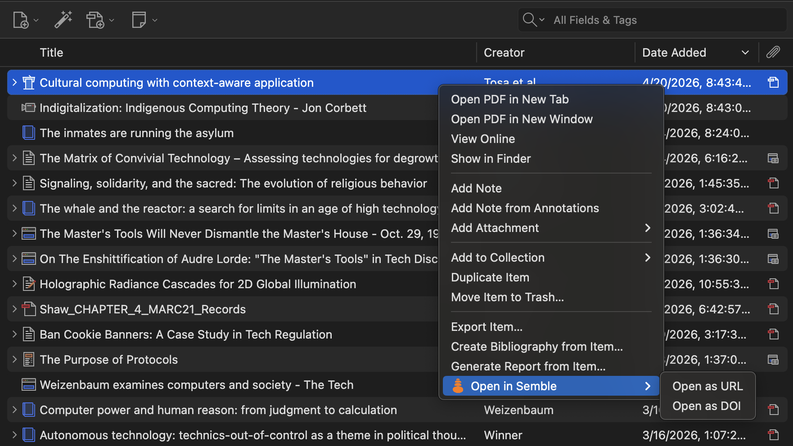

# Zemble (WIP)

> A Zotero plugin for integrating [Semble](https://semble.so), the social knowledge network for researchers.

## Installation

1. Go to the [latest release](https://github.com/ChrisShank/zemble/releases/latest) of the plugin.
2. Click on the `zemble.xpi` file to download it to your computer.
3. In Zotero, click `Tools > Plugins > "..." menu > "Open Plugin from File"` and open the zemble.xpi file that you just downloaded.

## Functionality

- Open items in Zotero directly in Semble.
  - Right-clicking on selected items in Zotero will now have an option to open URLs and DOIs in Semble in your browser. If multiple items are selected they will each load in separate browser tabs. 

## Contributing

Bugs and feature requests can be filed here. Checkout the [docs](/docs/README.md) for the structure of the repo and how to work with it locally. They are also translated to [chinese](/docs/README-zhCN.md) and [french](/docs/README-frFR.md).
